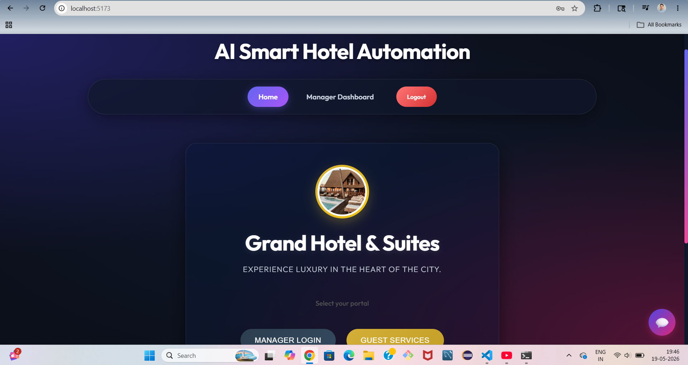
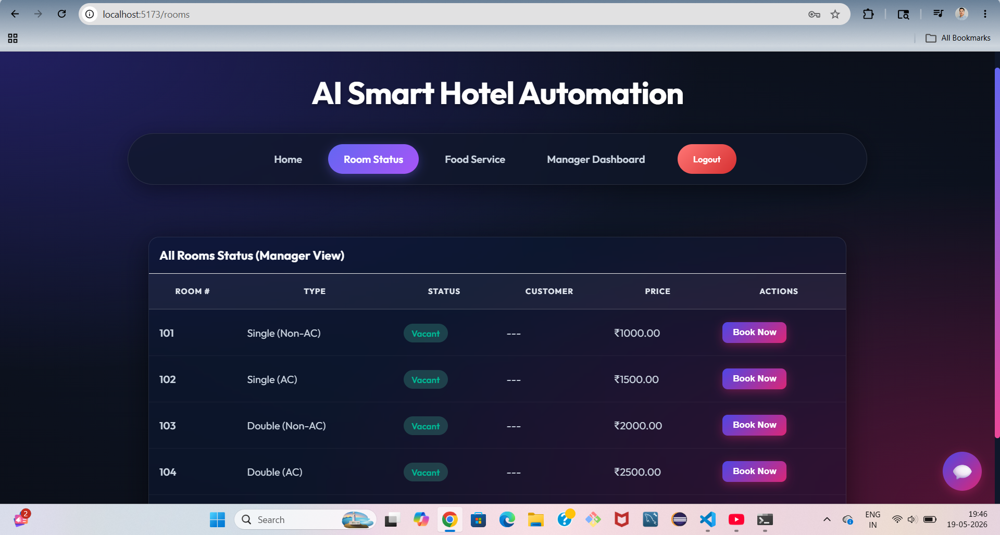
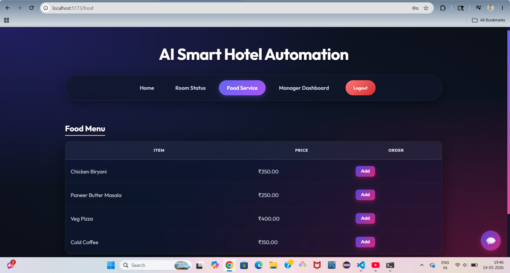
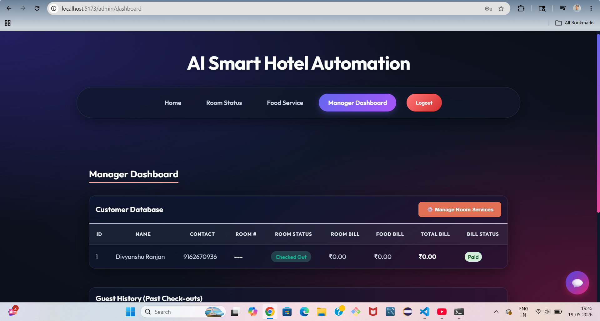
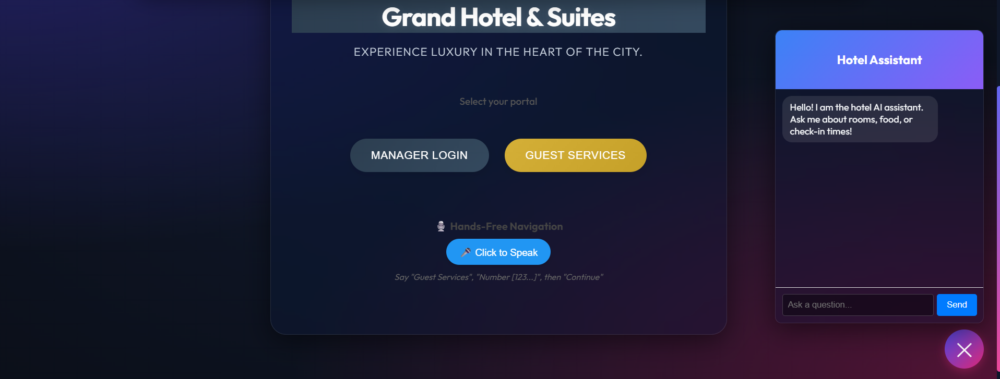

# 🏨 AI Smart Hotel Automation System

A modern full-stack hotel management application designed to automate and simplify hotel operations. The system provides seamless room booking, food ordering, billing, checkout management, room service handling, and an AI-powered hotel assistant chatbot for enhanced guest experience.

---

# 🚀 Features

* 🛏️ Room Booking & Management
* 🍽️ Food Ordering System
* 💳 Checkout & Billing
* 🤖 AI Hotel Assistant Chatbot (Gemini API)
* 👨‍💼 Manager/Admin Dashboard
* 🧾 Guest History Tracking
* 🛎️ Room Service Request Management
* 🔐 Admin Authentication System
* 📱 Responsive UI Design

---

# 🛠️ Tech Stack

## Frontend

* React.js
* Vite
* CSS

## Backend

* Java
* Spring Boot
* Spring Data JPA

## Database

* MySQL

## AI Integration

* Google Gemini API

## Build Tools

* Maven
* npm

---

# 📂 Project Structure

This repository is organized as a monorepo:

```bash
hotel-management/
│
├── hotel-frontend/   # React Frontend
│
└── hotel-app/        # Spring Boot Backend
```

---

# ⚙️ Installation & Setup

## 1️⃣ Clone Repository

```bash
git clone https://github.com/Abhishek804453/hotel-management-system.git
```

```bash
cd hotel-management-system
```

---

# 🔧 Backend Setup (Spring Boot)

Navigate to backend folder:

```bash
cd hotel-app
```

Update your database configuration in:

```properties
src/main/resources/application.properties
```

Run backend server:

```bash
./mvnw spring-boot:run
```

Backend will start on:

```bash
http://localhost:8080
```

---

# 💻 Frontend Setup (React)

Open a new terminal:

```bash
cd hotel-frontend
```

Install dependencies:

```bash
npm install
```

Start frontend server:

```bash
npm run dev
```

Frontend will start on:

```bash
http://localhost:5173
```

---

# 🔑 Environment Variables

Create a `.env` file if required for API keys.

Example:

```env
VITE_API_URL=http://localhost:8080/api

---

📸 Screenshots
🏠 Home Page



🛏️ Room Booking



🍽️ Food Ordering



👨‍💼 Manager Dashboard



🤖 AI Chatbot


# 🌟 Future Improvements

* Online Payment Gateway
* Email Notifications
* Role-Based Authentication
* Hotel Analytics Dashboard
* Multi-Hotel Support
* Cloud Deployment

---

# 👨‍💻 Author

Abhishek Kumar

GitHub:
https://github.com/Abhishek804453

